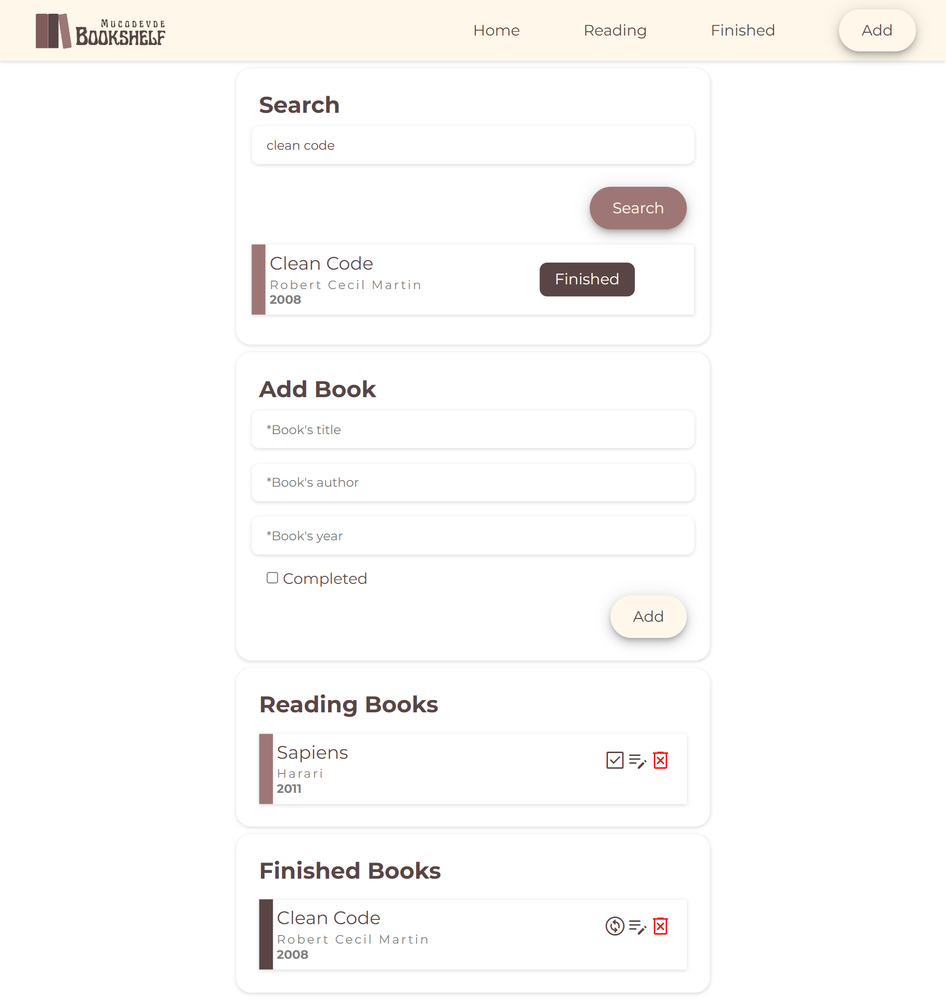

<!-- MY PROJECT -->
 

  
  <h3 align="center">Mucodevde</h3>

<!-- TABLE OF CONTENTS -->

  
Table of Contents

  <ol>
    <li><a href="#about-the-project">About The Project</a><li>
    <li><a href="#built-with">Built With</a></li>
  </ol>

<!-- ABOUT THE PROJECT -->
## About The Project

Create single page website and store data in local storage

(<a href="#readme-top">back to top</a>)

### Built With

This section should list any major frameworks/libraries used to bootstrap the project.

* [JavaScript](https://javascript.info/)

(<a href="#readme-top">back to top</a>)
